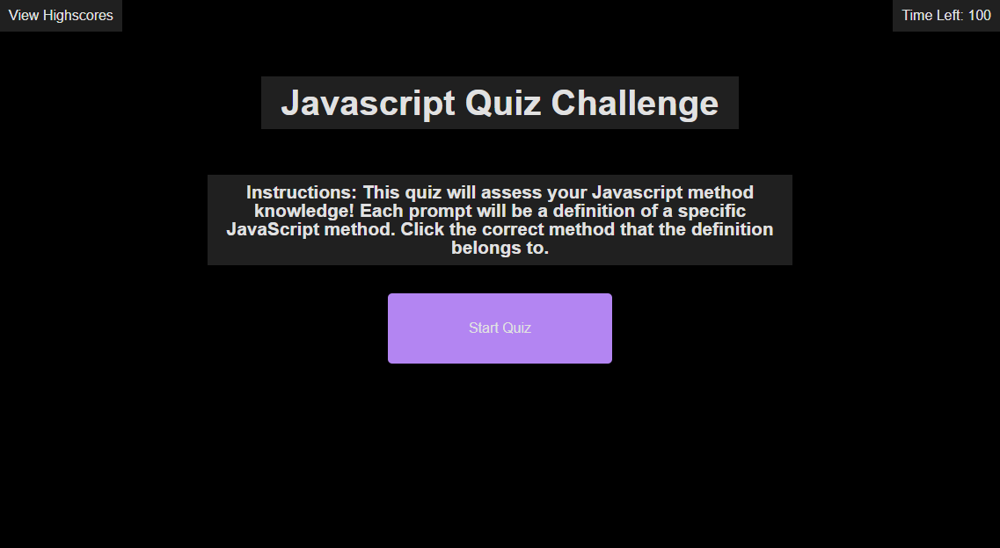
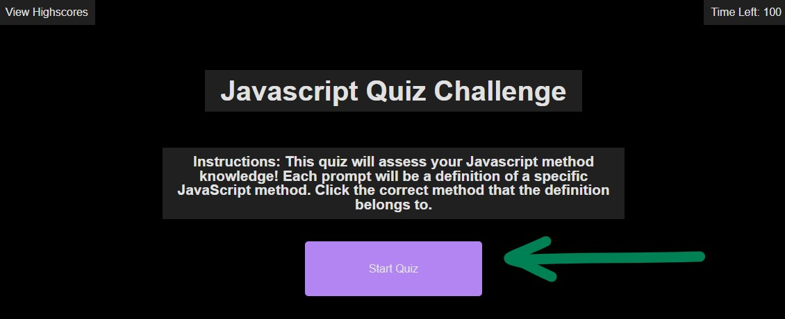
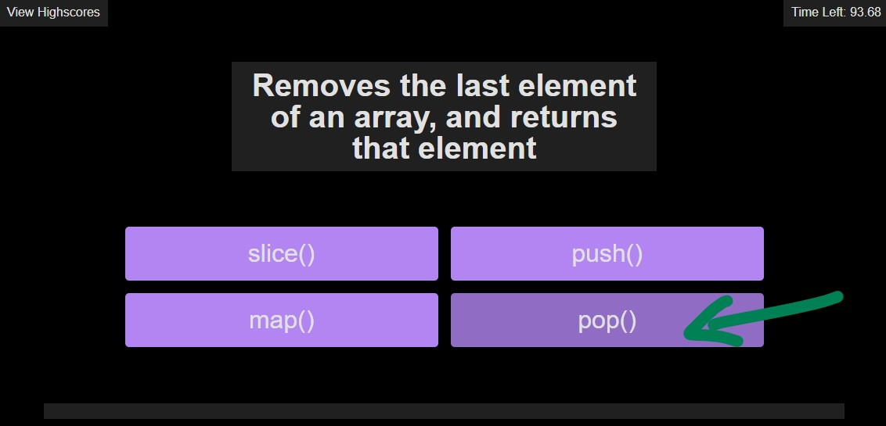
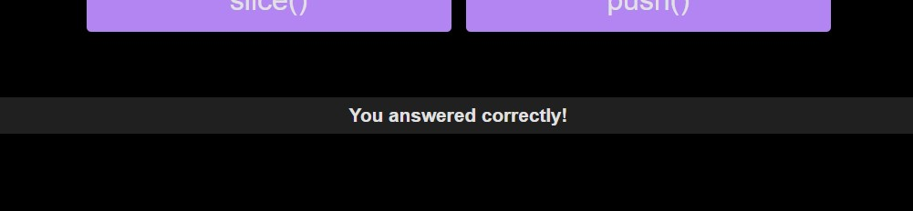
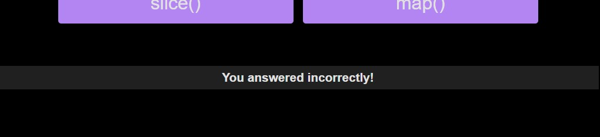
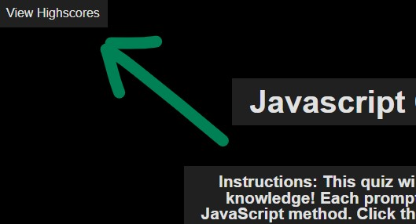

# Javascript Quiz

## Table of Contents
- [Project Goal](#Project-Goal)
- [Technologies](#Technologies)
- [Links](#Links)
- [Screenshot of Application](#Screenshot-of-Webpage)
- [User Instructions](#User-Instructions)
- [License](#License)
- [Contribution](#Contribution)
- [Acknowledgements](#Acknowledgements)
- [Questions](#Questions)

## Project Goal
The creators intentions for this application include:
1. To build a multiple choice quiz utilizing dynamically changing HTML5 and CSS3 powered by JavaScript.
2. To allow the user to store their own highscore in local storage.
3. To assess the users knowledge about JavaScript fundamentals.
4. To create a display that is responsive to different screensizes.

## Technologies
 
 
 

## Links
- ### [URL to Deployed Application](https://inklein1997.github.io/Javascript-Quiz/)
- ### [URL to Github Repository](https://github.com/inklein1997/Javascript-Quiz)

## Screenshot of Webpage

## User Instructions
1. **Click "Start Quiz"** to begin quiz.  
  
2. 100 second timer will begin.  Whatever time you have remaining at the end of the quiz will be your score.  
  
3. Read the array method definition at the top, and **click its matching method**.  
  
4. A prompt will at the bottom of the screen will indicate if your selection was **correct** or **incorrect**.
    - if **correct**, you will be directed to the next question.  
      
    - if **incorrect**, 10 seconds will be deducted from your time.  You will then be directed to the next question.
      
5. The quiz will end if: (1) the user answers all questions or (2) the timer reaches 0.  The user will then **enter their initials** into the input field and **click submit**

6. At any point of the quiz, the user may **click "View Highscores"** to view other user's highscores.  To exit the highscore interface, **reclick "View Highscores"**.

## License
  This project is licensed under the terms of [MIT](https://opensource.org/licenses/MIT).
  
## Contribution
Before contributing to **Javascript Quiz**, please read this [code of conduct](code_of_conduct.md)[^1]. 
Here's how you can contribute...
1. Add issue or recommendation for improvement to Issues tab on Github.
2. Submit pull request for review.

## Acknowledgements
- reset.css was provided by the University of Texas at Austin Coding Bootcamp curriculum

## Questions
If you have any questions, please contact me via:
1. GitHub -- [@inklein1997](https://github.com/inklein1997)
2. Email -- michaelklein1997@gmail.com

[^1]: Code of Conduct provided by [Contributor Covenant](https://www.contributor-covenant.org/)